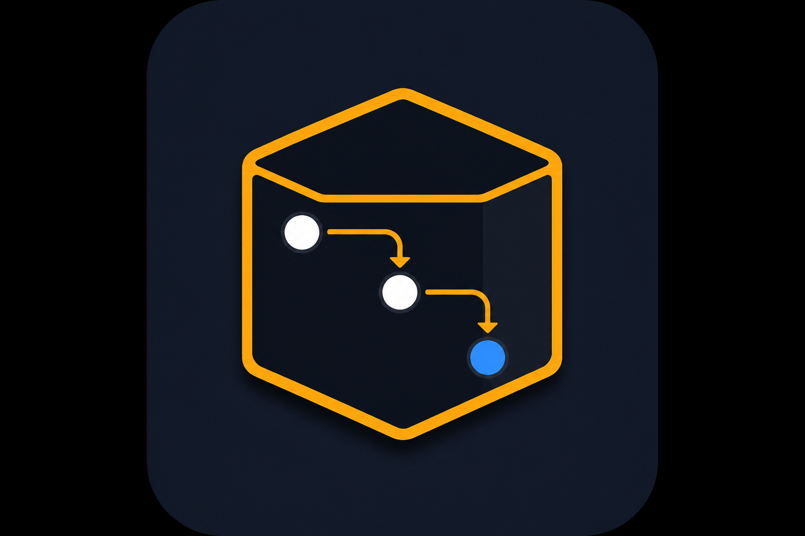

<p align="center">
  
</p>

# di-craft

A tiny TypeScript container that builds your services from tokens you declare, so types stay checked and you never need `reflect-metadata` or a framework.

- **Small.** 2,156 bytes minified + gzipped for the core entry. Zero runtime dependencies.
- **Typed.** Token types flow into factories and `container.get()`.
- **Explicit.** You list dependencies. Optional `@Injectable` is sugar over the same providers — no runtime type guessing, no global container.
- **Adapters.** Next.js App Router and Node.js request scopes are optional subpath imports, not part of core.

```ts
import { createContainer, createToken, provideFactory, provideValue } from "di-craft"

const NAME = createToken<string>("name")
const HI = createToken<string>("hi")
const di = createContainer([
  provideValue(NAME, "di-craft"),
  provideFactory(HI, { deps: { name: NAME }, useFactory: ({ name }) => `Hello, ${name}!` }),
])
di.get(HI) //=> "Hello, di-craft!"
```

> Dependencies are tokens you pass in. The container never inspects TypeScript types at runtime.

---

## Contents

- [When di-craft is a good fit](#when-di-craft-is-a-good-fit)
- [When you probably don't need di-craft](#when-you-probably-dont-need-di-craft)
- [Getting started](#getting-started)
- [Tokens and providers](#tokens-and-providers)
- [Scopes and child containers](#scopes-and-child-containers)
- [Optional dependencies](#optional-dependencies)
- [Class providers](#class-providers)
- [Next.js and Node adapters](#nextjs-and-node-adapters)
- [Guides](#guides)
- [AI coding agents](#ai-coding-agents)
- [API](#api)
- [License](#license)

---

## When di-craft is a good fit

- You want the dependency graph visible in TypeScript, not reconstructed from
  decorator metadata.
- You need request-scoped values in Next.js App Router / RSC or in Node.js
  async work, without a full framework DI.
- Tests should swap providers via child containers, not by mocking modules.

## When you probably don't need di-craft

- You already live in Nest and want its modules and testing utilities — Nest DI
  is the better default there.
- You specifically want decorator-only injection backed by `reflect-metadata`
  (Inversify / tsyringe style).
- You can pass a handful of dependencies by hand and a container would only
  add ceremony.

---

## Getting started

Needs **Node.js 20+**. The package is **ESM-only**.

**1. Add it to an existing project**

```bash
npm install di-craft
```

**2. Save this file as `greeting.ts`**

```ts
import { createContainer, createToken, provideFactory, provideValue } from "di-craft"

const NAME = createToken<string>("name")
const HI = createToken<string>("hi")
const di = createContainer([
  provideValue(NAME, "di-craft"),
  provideFactory(HI, { deps: { name: NAME }, useFactory: ({ name }) => `Hello, ${name}!` }),
])

console.log(di.get(HI))
```

**3. Run it**

```bash
npx --yes tsx greeting.ts
```

You should see:

```txt
Hello, di-craft!
```

Call `container.get()` at composition roots (entrypoints, route handlers, tests). Pass constructed services into domain classes — do not pass the container itself.

---

## Tokens and providers

A **token** is a unique typed key. A **provider** tells the container how to build that value. Factory `deps` keys become the object passed to `useFactory`.

- **`createToken<T>(name)`** — identity is an internal symbol; the name is diagnostics only. Two tokens with the same name are still different.
- **`provideValue(token, value)`** — register a value that already exists.
- **`provideFactory(token, options)`** — build lazily (`deps`, `scope`, `onDispose`).
- **`createContainer(providers?)`** — store providers and resolve on demand.
- **`container.register(provider)`** — add later. Duplicate tokens throw unless `{ allowOverride: true }`.

Resolution is **synchronous**. For async setup, await first and `provideValue` the ready instance, or register a `Promise` and `await container.get(token)`.

Full rules: [Core concepts](./docs/core.md).

---

## Scopes and child containers

| Scope | Behavior |
| --- | --- |
| `singleton` (default) | One cached instance on the container that owns the provider |
| `transient` | A new instance on every `get` |
| `scoped` | One cached instance per resolving container |

A provider may only depend on dependencies that live at least as long as itself.

**Child containers** inherit parent providers and can add or override locals — the pattern for per-request data:

```ts
const child = createChildContainer(root, [provideValue(REQUEST, request)])
```

- Look up in the child first, then the parent chain.
- `singleton` is cached where the provider was registered.
- `scoped` is cached on the container that is resolving.
- `dispose()` only disposes the container you call it on.

---

## Optional dependencies

Wrap a token with `optional()` when it may be missing. The type becomes `T | undefined`.

```ts
provideFactory(USERS, {
  deps: { logger: optional(LOGGER) },
  useFactory: ({ logger }) => new UserService(logger),
})
```

---

## Class providers

`@Injectable` keeps token, constructor deps, scope, and disposal next to the class. `provideInjectable` turns that into a normal factory provider.

```ts
@Injectable({ token: USERS, deps: [LOGGER] })
class UserService {
  constructor(private readonly logger: Logger) {}
}

const container = createContainer([
  provideValue(LOGGER, new Logger()),
  provideInjectable(UserService),
])
```

Walkthrough: [Annotation-based providers](./docs/annotations.md).

---

## Next.js and Node adapters

React, Next.js, and `AsyncLocalStorage` stay out of `import "di-craft"`. Import a subpath only when you need it.

| Import | Use it for |
| --- | --- |
| `di-craft/next/server` | RSC render-scoped containers (`createNextDi`, `dehydrate`) |
| `di-craft/next/client` | Client-boundary hydration (`hydrate`) |
| `di-craft/node` | Node.js request scopes via `AsyncLocalStorage` (`createNodeDi`) |

```txt
server DI container → serializable snapshot → client state
```

The Node adapter is for code **outside** the RSC render tree. It imports `node:async_hooks` and is not intended for Edge.

Do not mix RSC render scope (`di-craft/next/server`) with Node
`AsyncLocalStorage` scope (`di-craft/node`).

- [Next.js App Router adapter](./docs/next.md)
- [Node.js async context adapter](./docs/node.md)

---

## Guides

- [Core concepts](./docs/core.md)
- [Annotation-based providers](./docs/annotations.md)
- [Next.js App Router adapter](./docs/next.md)
- [Node.js async context adapter](./docs/node.md)

Typed examples checked by `bun run typecheck:examples`:

- [basic container](./examples/typed-docs/core/basic.ts)
- [scopes and child containers](./examples/typed-docs/core/scopes.ts)
- [optional dependencies](./examples/typed-docs/core/optional.ts)
- [disposal hooks](./examples/typed-docs/core/disposal.ts)
- [annotation-based providers](./examples/typed-docs/annotations/injectable.ts)
- [Next.js request scope](./examples/typed-docs/next/request-scope.ts)
- [Next.js nested Server Components](./examples/typed-docs/next/nested-server-components.ts)
- [Next.js Route Handler](./examples/typed-docs/next/route-handler.ts)
- [Next.js Server Action](./examples/typed-docs/next/server-action.ts)
- [Next.js state hydration](./examples/typed-docs/next/hydration.ts)
- [Node.js async context](./examples/typed-docs/node/async-context.ts)
- [Next.js Node runtime ALS context](./examples/typed-docs/node/next-runtime-als.ts)

---

## AI coding agents

A versioned Agent Skill will ship inside the npm package (`skills/di-craft`)
and be discoverable via [skills-npm](https://github.com/antfu/skills-npm). Until
that lands, treat this README and `docs/` as the source of truth: explicit
tokens, `get()` only in composition roots, child-container overrides in tests,
and separate Next vs Node scopes.

---

## API

| Export | Description |
| --- | --- |
| `createToken<T>(name)` | Unique typed token |
| `provideValue(token, value)` | Register an existing value |
| `provideFactory(token, options)` | Lazy factory with deps, scope, disposal |
| `@Injectable(options)` | Class-level provider metadata |
| `provideInjectable(class)` | Turn an injectable class into a factory provider |
| `optional(token)` | Allow a missing dependency |
| `createContainer(providers?)` | Create a container |
| `createChildContainer(parent, providers?)` | Child that inherits from `parent` |
| `Scopes` | `Singleton`, `Transient`, `Scoped` |

Errors (all extend `DiError`): `MissingProviderError`, `DuplicateProviderError`, `CircularDependencyError`, `InvalidDependencyError`, `InvalidProviderError`.

---

## License

[MIT](./LICENSE)
